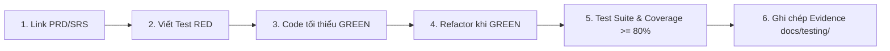

# Quy Trình Chuẩn Git & GitHub (Nightmare Studio Git Workflow)

Tài liệu này quy định tiêu chuẩn bắt buộc cho mọi hoạt động quản lý mã nguồn, tạo nhánh, viết commit, kiểm thử và hợp nhất (merge) code trong dự án **Nightmare Studio**.

---

## 1. Chiến Lược Phân Nhánh (Branching Strategy)

Dự án áp dụng mô hình **Trunk-Based Development kết hợp Feature Branching**.

### 1.1. Nhánh Chính (`main`)
- Nhánh `main` là nhánh nguồn chân lý (Source of Truth), luôn ở trạng thái sẵn sàng chạy và vượt qua mọi bài kiểm thử.
- **Quy định**:
  - Tuyệt đối **KHÔNG commit hoặc push trực tiếp** lên nhánh `main`.
  - Mọi thay đổi vào `main` bắt buộc phải thông qua **Pull Request (PR)** và vượt qua toàn bộ CI Checks.

### 1.2. Quy Tắc Đặt Tên Nhánh (Branch Naming Conventions)
Tất cả nhánh làm việc phải được đặt tên theo định dạng chuẩn: `<loại-nhánh>/<mã-định-danh>-<mô-tả-ngắn>`

| Loại nhánh | Mục đích | Ví dụ |
| :--- | :--- | :--- |
| `feature/` | Phát triển tính năng mới gắn với PRD/SRS | `feature/prd-03-storyboard-editor` |
| `bugfix/` | Sửa lỗi phát hiện trong quá trình phát triển | `bugfix/issue-14-audio-sync` |
| `hotfix/` | Sửa lỗi khẩn cấp trực tiếp cho bản phát hành | `hotfix/fastapi-startup-crash` |
| `refactor/` | Tái cấu trúc mã nguồn (không thay đổi hành vi) | `refactor/repository-query-builder` |
| `test/` | Bổ sung bài kiểm thử hoặc cải thiện coverage | `test/add-e2e-dashboard-cases` |
| `docs/` | Cập nhật tài liệu kỹ thuật, PRD, SRS | `docs/update-architecture-flow` |
| `chore/` | Cập nhật dependencies, CI/CD pipeline | `chore/upgrade-nextjs-16` |

---

## 2. Quy Chuẩn Commit Message (Conventional Commits)

Mọi commit bắt buộc tuân theo chuẩn **Conventional Commits 1.0.0**:

```text
<type>(<scope>): <short summary>

[optional body: giải thích chi tiết lý do và bối cảnh thay đổi]

[optional footer: Closes #issue-id hoặc Refs #prd-id]
```

### 2.1. Các Type Hợp Lệ:
- `feat`: Tính năng mới cho người dùng hoặc API.
- `fix`: Sửa lỗi cho người dùng hoặc hệ thống.
- `refactor`: Thay đổi code không thêm tính năng mới cũng không sửa lỗi.
- `test`: Bổ sung bài test mới hoặc chỉnh sửa test có sẵn.
- `docs`: Chỉ thay đổi tài liệu.
- `style`: Định dạng code (whitespace, format, dấu chấm phẩy - không đổi logic).
- `perf`: Cải thiện hiệu năng xử lý.
- `chore`: Thay đổi cấu hình build, công cụ hỗ trợ, dependencies.

### 2.2. Các Scope Thường Dùng:
- Backend: `core`, `domain`, `jobs`, `discovery`, `media`, `providers`, `api`, `repo`
- Frontend: `web`, `ui`, `desk`, `components`, `lib`
- Khác: `infra`, `ci`, `docs`, `deps`

### 2.3. Ví dụ Chuẩn:
```bash
# Ví dụ commit tính năng:
feat(discovery): add Reddit RSS parsing with rate-limit retry

# Ví dụ commit sửa lỗi:
fix(media): resolve video concatenation timeout on long sequences

# Ví dụ commit kiểm thử:
test(domain): add state transition validation tests for episode review
```

---

## 3. Quy Trình Phát Triển 6 Bước (Required TDD Development Loop)

Tuân thủ nghiêm ngặt theo **CODING_STANDARDS.md §1**:



1. **Liên kết định danh**: Xác định tính năng thuộc PRD ID và SRS Section nào.
2. **Viết test trước (RED)**: Tạo bài kiểm thử và chạy để xác nhận test thất bại có chủ đích.
3. **Cài đặt code (GREEN)**: Viết lượng mã tối thiểu để bài test trên chuyển sang thành công.
4. **Refactor**: Tối ưu hóa code trong khi vẫn đảm bảo test luôn GREEN.
5. **Đo độ bao phủ (Coverage)**: Chạy toàn bộ test suite. Coverage bắt buộc đạt **>= 80%** lines/branches.
6. **Lưu bằng chứng**: Thêm báo cáo RED/GREEN vào thư mục `docs/testing/`.

---

## 4. Quy Trình Pull Request & Code Review (PR Policy)

### 4.1. Tiêu Chuẩn Mở PR:
- Tiêu đề PR phải tuân theo chuẩn Conventional Commits (ví dụ: `feat(web): integrate storyboard image upload`).
- Điền đầy đủ nội dung theo mẫu [`.github/pull_request_template.md`](file:///f:/truyen_ma/nightmare_studio/.github/pull_request_template.md).
- Gắn thẻ (Labels) và Người chỉ định (Assignee) rõ ràng.

### 4.2. Điều Kiện Để PR Được Hợp Nhất (Merge Criteria):
- [x] Tất cả các bước trong CI Pipeline (`ci.yml`) phải vượt qua (Status: GREEN).
- [x] Không có xung đột nhánh (No merge conflicts).
- [x] Nhận được ít nhất **1 phê duyệt (Approval)** từ Code Owner.
- [x] Mọi cuộc thảo luận (Review comments) đã được giải quyết (Resolved).

### 4.3. Chiến Lược Hợp Nhất (Merge Strategy):
- Áp dụng **Squash and Merge**: Gộp toàn bộ các commit nhỏ trong nhánh tính năng thành 1 commit duy nhất trên `main` để giữ lịch sử Git luôn sạch và dễ theo dõi (`git log --oneline`).

---

## 5. Hướng Dẫn Thiết Lập Branch Protection Trên GitHub

Để quy định có hiệu lực bắt buộc trên GitHub Web, quản trị viên (Owner) cần thiết lập như sau:

1. Truy cập **GitHub Repository** -> **Settings** -> **Branches** (hoặc **Rulesets**).
2. Nhấn **Add branch protection rule** (Branch name pattern: `main`).
3. Kích hoạt các tùy chọn sau:
   - ✅ **Require a pull request before merging**:
     - Require approvals: `1`
     - Dismiss stale pull request approvals when new commits are pushed: `Checked`
   - ✅ **Require status checks to pass before merging**:
     - Require branches to be up to date before merging: `Checked`
     - Status checks bắt buộc:
       - `Backend (Python 3.12)`
       - `Frontend (Next.js & TypeScript)`
   - ✅ **Require conversation resolution before merging**: `Checked`
   - ✅ **Do not allow bypassing the above settings**: `Checked` (áp dụng cho cả Administrators).
4. Nhấn **Save changes**.

---

## 6. Chính Sách Bảo Mật & Phòng Tránh Dữ Liệu Rác

- **Tuyệt đối không commit**:
  - File môi trường `.env`, `.env.local` hoặc bất kỳ API Key nào.
  - File cơ sở dữ liệu SQLite (`*.db`, `*.sqlite3`).
  - Dữ liệu media render (`outputs/`, `data/outputs/`).
  - Dữ liệu profile trình duyệt CDP (`data/canvas-cdp-profile/`).
- Mọi trường hợp vi phạm sẽ bị phát hiện tự động bởi bước **Secret & Credential Scan** trong CI.
